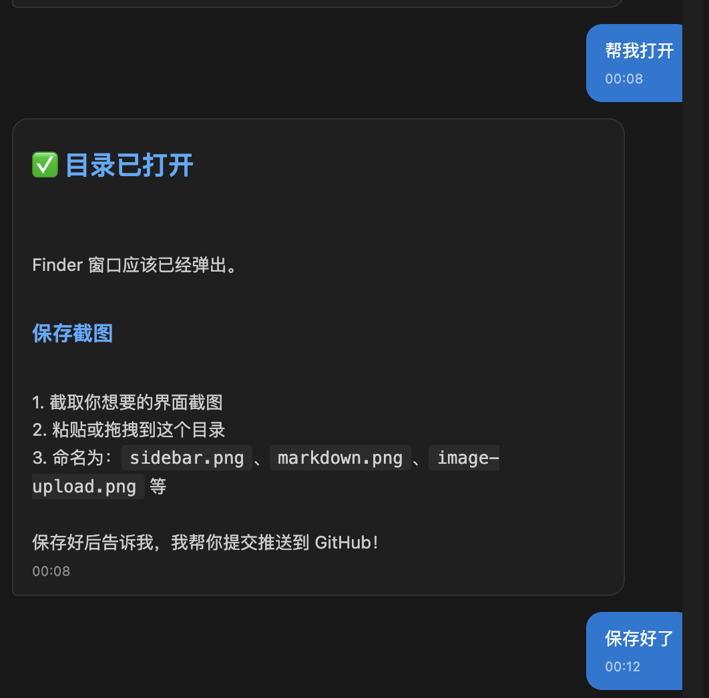

# Panel Feedback 💬

> **The Next-Gen AI Feedback Experience - Embedded in Your IDE**

Tired of pop-up windows interrupting your workflow? **Panel Feedback** brings AI interaction directly into your IDE's sidebar - no more context switching, no more annoying dialogs.

Born as an evolution of [寸止](https://github.com/imhuso/cunzhi), Panel Feedback takes the concept further with a **non-intrusive, embedded panel** that stays right where you need it.

[中文文档](./README_CN.md)

## ✨ Why Panel Feedback?

| Feature | Panel Feedback | Traditional Pop-ups |
|---------|---------------|---------------------|
| **Location** | IDE Sidebar | Floating Window |
| **Focus** | Never lost | Constantly interrupted |
| **Integration** | Native feel | External tool |
| **Image Support** | ✅ Paste/Drag/Upload | Limited |
| **Markdown** | ✅ Full support | Varies |

## 🌟 Features

- 💬 **Embedded Panel** - Lives in your IDE sidebar, always accessible
- 🎨 **Rich Markdown** - Beautiful rendering of AI responses
- 📷 **Image Support** - Paste, drag & drop, or upload images
- ⚡ **Quick Options** - Predefined buttons for fast responses
- 🔌 **MCP Protocol** - Standard Model Context Protocol support
- 🎯 **Zero Distraction** - No pop-ups, no focus stealing

## 📸 Screenshots

### Sidebar Integration


The feedback panel lives in your IDE - always visible, never intrusive.

## 🚀 Installation

### Prerequisites
- VS Code, Windsurf, or any VS Code-compatible IDE
- Node.js 18+

### Quick Install

1. **Download the extension**
   ```bash
   git clone https://github.com/fhyfhy17/panel-feedback.git
   cd panel-feedback
   npm install
   npm run compile
   ```

2. **Package the extension**
   ```bash
   npx vsce package --allow-missing-repository
   ```

3. **Install in your IDE**
   ```bash
   code --install-extension panel-feedback-1.0.0.vsix
   # Or for Windsurf
   windsurf --install-extension panel-feedback-1.0.0.vsix
   ```

### MCP Configuration

Add to your MCP config file (e.g., `mcp_config.json`):

```json
{
  "mcpServers": {
    "panel-feedback": {
      "command": "node",
      "args": ["/path/to/panel-feedback/mcp-stdio-wrapper.js"]
    }
  }
}
```

## 📖 Usage

### For AI Assistants

Add this to your AI assistant's system prompt:

```
Global rules for using feedback MCP tools:

**Use panel-feedback exclusively**
- For all user feedback scenarios, use only panel_feedback
- Do NOT use other feedback tools (pop-up dialogs, etc.)

**When to use:**
- Asking questions or confirmations
- Before completing any request
- When user selection is needed
- Any scenario requiring user input

**Usage rules:**
- NEVER ask questions directly to the user
- All clarifications and feedback MUST go through panel_feedback
- Before completing any request, MUST use panel_feedback to get user confirmation
- Keep calling panel_feedback until user's feedback is empty, then end the request
- Provide clear messages with Markdown formatting
- Include predefined_options for quick responses
```

### Tool Schema

```json
{
  "name": "panel_feedback",
  "description": "Display a message in IDE sidebar and get user feedback",
  "inputSchema": {
    "type": "object",
    "properties": {
      "message": {
        "type": "string",
        "description": "Message to display (Markdown supported)"
      },
      "predefined_options": {
        "type": "array",
        "items": { "type": "string" },
        "description": "Quick response buttons"
      }
    },
    "required": ["message"]
  }
}
```

## 🔧 Development

```bash
# Clone the repo
git clone https://github.com/fhyfhy17/panel-feedback.git
cd panel-feedback

# Install dependencies
npm install

# Compile
npm run compile

# Watch mode
npm run watch

# Package
npm run package
```

## 🆚 Comparison with 寸止

Panel Feedback is inspired by and compatible with 寸止's approach, but with key improvements:

| Aspect | Panel Feedback | 寸止 |
|--------|---------------|------|
| **UI** | Embedded sidebar | Pop-up window |
| **Focus** | Never interrupts | May steal focus |
| **Platform** | VS Code extension | Standalone app |
| **Image** | Full support | Supported |
| **Markdown** | Full support | Supported |

## 🤝 Contributing

Contributions are welcome! Feel free to:

- 🐛 Report bugs
- 💡 Suggest features
- 🔧 Submit pull requests

## 📄 License

MIT License - Free to use and modify!

## 🙏 Acknowledgments

- [寸止](https://github.com/imhuso/cunzhi) - The original inspiration for AI feedback tools
- [interactive-feedback-mcp](https://github.com/noopstudios/interactive-feedback-mcp) - MCP feedback implementation reference

---

**Made with ❤️ for better AI-human collaboration**
